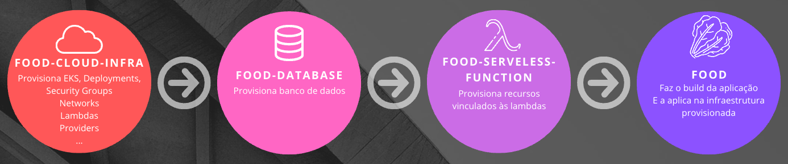

# Infraestrutura da aplicação em nuvem - ALFAC

Este é um repositório Git que utiliza o Terraform para gerenciar infraestrutura na nuvem da aplicação [Fast Food - ALFAC](https://github.com/ALFAC-Org/food). Nele, você encontrará arquivos de configuração do Terraform que definem a infraestrutura como código. No momento, o repositório está focado na Amazon Web Services (AWS), entretanto, o repositório é flexível para adaptação para outros provedores de serviços de nuvem.

> [!WARNING]
> **Para completo funcionamento do sistema, é necessário seguir todo o fluxo de provisionamento: 1. A provisão deste repositório; 2. a provisão do repositório de banco de dados [https://github.com/ALFAC-Org/food-database](https://github.com/ALFAC-Org/food-database); 3. A provisão das lambdas [https://github.com/ALFAC-Org/food-serveless-function](https://github.com/ALFAC-Org/food-serveless-function); 4. E por fim, a o provisionamento da aplicação principal, utilizando de todos os recursos anteriormente criados em [https://github.com/ALFAC-Org/food](https://github.com/ALFAC-Org/food)**



## Diagrama


## Tutoriais

| Passo | Vídeo |
|-------|-------|
| 0. Introdução geral | [0-INTRODUCAO-GERAL](https://drive.google.com/file/d/1E9v5AYdDJZeDYTBuxv9MxESB194wfX2q/view?usp=drive_link) |
| 1. Introdução aos repositórios | [1-INTRODUCAO-REPOSITORIOS](https://drive.google.com/file/d/1jViIPSCdinQ0Dbvf9VCHRd_qryEZiHdz/view?usp=drive_link) |
| 2. Configuração das variáveis ambiente | [2-CONFIGURACAO-VARIAVEIS](https://drive.google.com/file/d/1QnLUTGbsOQ0hj0cI0CifeCAwBANxmy98/view?usp=drive_link) |
| 3. Provisão da infraestrutura com [https://github.com/ALFAC-Org/food-cloud-infra](https://github.com/ALFAC-Org/food-cloud-infra) | [3-INFRA-PARTE-1](https://drive.google.com/file/d/1J10-wJGOLysgZtSyTtVhfSJG-YrguhAi/view?usp=drive_link) / [3-INFRA-PARTE-2](https://drive.google.com/file/d/1Tzztu_W3Qx5WZdocE49yRNigKO4W1qkz/view?usp=drive_link) |
| 4. Provisão do banco de dados com [https://github.com/ALFAC-Org/food-database](https://github.com/ALFAC-Org/food-database) | [4-DATABASE-PARTE-1](https://drive.google.com/file/d/1FyC0uFHNiWsP8tH7p_mdzSRgtFazag2E/view?usp=drive_link) / [4-DATABASE-PARTE-2](https://drive.google.com/file/d/1TCs5dfF6cqnvYOK5kZ-d5RKUbrv9zruI/view?usp=drive_link) |
| 5. Provisão do lambda com [https://github.com/ALFAC-Org/food-serveless-function](https://github.com/ALFAC-Org/food-serveless-function) | [5-LAMBDA](https://drive.google.com/file/d/1djIEy_YctnqSyXRNUPC45prQ0wwiZjks/view?usp=drive_link) |
| 6. Provisão da aplicação principal com [https://github.com/ALFAC-Org/food](https://github.com/ALFAC-Org/food) | [6-FOOD](https://drive.google.com/file/d/1wHJnIbI-bFn25VH4hmYfrrW0xTxSAfKv/view?usp=drive_link) |
| 7. Demonstrando tudo: API Gateway + Lambda + Load Balancer + EKS junto do fluxo do usuário | [7-FLUXO](https://drive.google.com/file/d/1vJRNaJK86aQIZCpjcT6Hqpxg4Aq9JREv/view?usp=drive_link) |

## Como rodar o projeto

Variáveis a se trocar:

- `ARN_AWS_LAB_ROLE`
- `AWS_ACCESS_KEY_ID`
- `AWS_SECRET_ACCESS_KEY`
- `AWS_SESSION_TOKEN`
- `AWS_BUCKET_NAME`
- `LAMBDA_BUCKET_NAME`

Existem duas formas com as quais você pode ver esse repositório em ação:

- **Via GitHub Actions (recomendada)**
- Localmente

### Via GitHub Actions (recomendada)

<details>
  <summary>Passo a passo</summary>

1. Acesse [https://github.com/ALFAC-Org/food-cloud-infra/actions](https://github.com/ALFAC-Org/food-cloud-infra/actions) (A guia `Actions` deste repositório);
2. Acesse `AWS - Cria infraestrutura`;
3. Clique em `Run workflow` (ou Executar workflow);
4. Aguarde. Se tudo der certo, o `check` verde deverá aparecer, os `outputs` irão ser exibidos e você poderá acessar a url - o processo dura em torno de 10 a 20 minutos;
   1. 
   2. 

</details>

### Localmente

<details>
  <summary>Passo a passo</summary>

#### Pré-requisitos

Antes de começar, certifique-se de ter os seguintes itens instalados e configurados em seu ambiente:

1. **Terraform**: A ferramenta que permite definir, visualizar e implantar a infraestrutura de nuvem.
2. **AWS CLI**: A interface de linha de comando da AWS.
3. **Credenciais AWS válidas**: Você precisará de uma chave de acesso e uma chave secreta para autenticar com a AWS (no momento, o repositório usa chaves e credenciais fornecidas pelo [AWS Academy](https://awsacademy.instructure.com/) e que divergem de contas padrão).

## Como usar

1. **Clone este repositório**:

```bash
git clone https://github.com/ALFAC-Org/food-cloud-infra
```

2. **Acesse o diretório do repositório**:

```bash
cd food-cloud-infra
```

3. **Configure as credenciais AWS em seu ambiente**:

```bash
aws configure
```

4. Defina as variáveis necessárias ao nível de ambiente, via arquivo `.tfvars` ou passe através dos comandos. Exemplo:

```bash
terraform <comando> <parâmetros> \
-var "environment=$ENVIRONMENT" \
-var "image_name=$IMAGE_NAME" \
-var "image_username=$DOCKERHUB_USERNAME" \
-var "image_version=$IMAGE_VERSION" \
-var "app_port=$APP_PORT" \
-var "enable_flyway=$ENABLE_FLYWAY" \
-var "aws_region=$AWS_REGION" \
-var "node_role_arn=$ARN_AWS_LAB_ROLE" \
-var "vpc_name=$VPC_NAME" \
-var "vpc_cidr_block=$VPC_CIDR_BLOCK" \
-var "subnet_private_1_cidr_block=$SUBNET_PRIVATE_1_CIDR_BLOCK" \
-var "subnet_private_2_cidr_block=$SUBNET_PRIVATE_2_CIDR_BLOCK" \
-var "subnet_public_1_cidr_block=$SUBNET_PUBLIC_1_CIDR_BLOCK" \
-var "subnet_public_2_cidr_block=$SUBNET_PUBLIC_2_CIDR_BLOCK" \
-var "subnet_availability_zone_az_1=$SUBNET_AVAILABILITY_ZONE_AZ_1" \
-var "subnet_availability_zone_az_2=$SUBNET_AVAILABILITY_ZONE_AZ_2" \
-var "db_username=$DB_USERNAME" \
-var "db_password=$DB_PASSWORD" \
-var "db_name=$DB_NAME" \
-var "db_host=$DB_HOST" \
-var "kubernetes_namespace=$CLUSTER_NAMESPACE" \
-var "cluster_name=$CLUSTER_NAME" \
-var "bucket_food_lambdas=$LAMBDA_BUCKET_NAME"
```

1. **Inicialize o diretório Terraform**:

```bash
terraform init
```

5. **Visualize as mudanças que serão feitas**:

```bash
terraform plan \
-var "environment=$ENVIRONMENT" \
-var "image_name=$IMAGE_NAME" \
-var "image_username=$DOCKERHUB_USERNAME" \
...variáveis
```

6. **Provisione a infraestrutura**:

```bash
terraform apply \
-var "environment=$ENVIRONMENT" \
-var "image_name=$IMAGE_NAME" \
-var "image_username=$DOCKERHUB_USERNAME" \
...variáveis
```

7. **Para destruir a infraestrutura provisionada**:

```bash
terraform destroy \
-var "environment=$ENVIRONMENT" \
-var "image_name=$IMAGE_NAME" \
-var "image_username=$DOCKERHUB_USERNAME" \
...variáveis
```

</details>

### Recursos provisionados

Os seguintes recursos serão criados com os arquivos de configuração Terraform:

- VPC;
- 2 Sub-redes pública;
- 2 Sub-redes privadas;
- Internet Gateway;
- Tabela de roteamento;
- Security Groups;
- 2 Instâncias EC2;
- Lambdas;
- Ingress;
- Load Balancer

### Acessando a aplicação (Load Balancer)

Para acessar a aplicação, pegue a url gerado no output `load_balancer_hostname`, através de algum dos processo anteriormente citados (via GitHub Actions ou localmente). Adicione `8080` como porta. Exemplo:

`http://a837b0b23848e46afa45405c9ef0b060-4303509eac57f9bb.elb.us-east-1.amazonaws.com:8080/api-docs`

Você deverá ver algo do tipo:


## Membros

|Membro| Informações |
|--|--|
| Leonardo Fraga | - *RM354771* <br />- *[rm354771@fiap.com.br](mailto:rm354771@fiap.com.br)* <br />- [@LeonardoFraga](https://github.com/LeonardoFraga) |
| Carlos Henrique Carvalho de Santana | - *RM355339* <br />-  *[rm355339@fiap.com.br](mailto:rm355339@fiap.com.br)* <br />- [@carlohcs](https://github.com/carlohcs) |
| Leonardo Alves Campos | - *RM355568* <br />- [rm355568@fiap.com.br](mailto:rm355568@fiap.com.br) <br />- [@lcalves](https://github.com/lcalves) |
| Andre Musolino | -  *RM355582* <br />- *[rm355582@fiap.com.br](mailto:rm355582@fiap.com.br)* <br />- [@amusolino](https://github.com/amusolino) |
