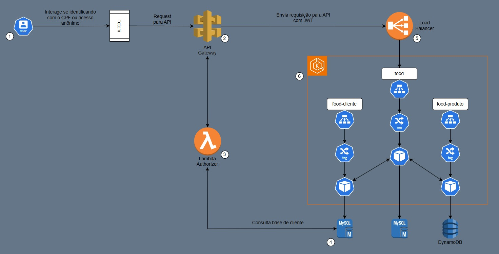
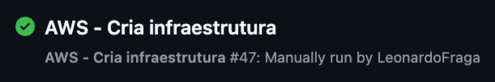
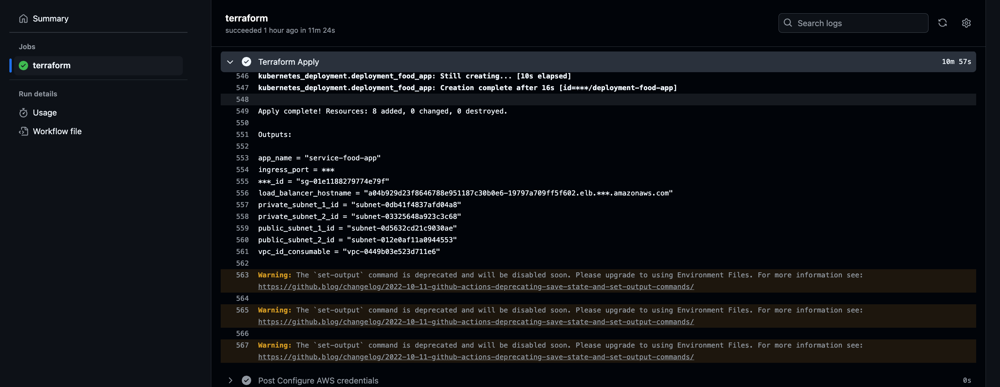
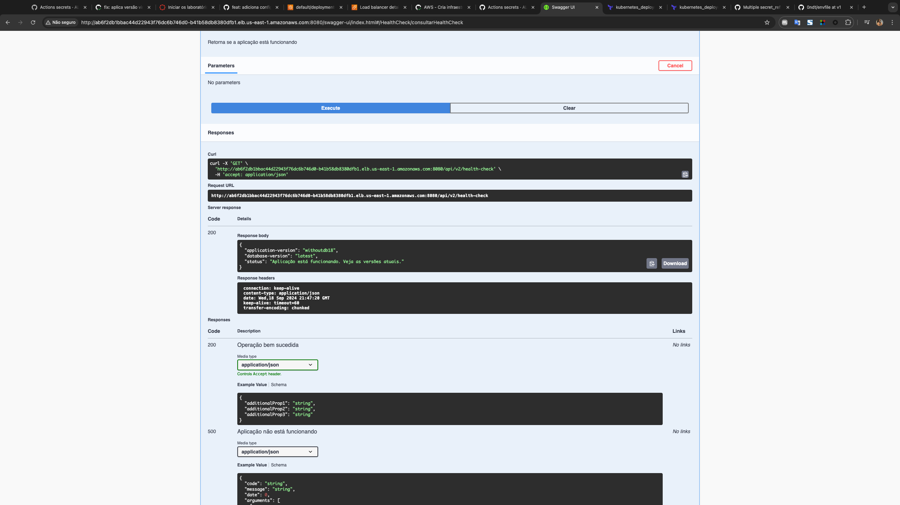

# Infraestrutura da aplicação em nuvem - ALFAC

Este é um repositório Git que utiliza o Terraform para gerenciar infraestrutura na nuvem da aplicação [Fast Food - ALFAC](https://github.com/ALFAC-Org/food). Nele, você encontrará arquivos de configuração do Terraform que definem a infraestrutura como código. No momento, o repositório está focado na Amazon Web Services (AWS), entretanto, o repositório é flexível para adaptação para outros provedores de serviços de nuvem.

> [!WARNING]
> Para completo funcionamento da plataforma, é necessário seguir todo o fluxo de provisionamento:
> 1. A provisão deste repositório;
> 2. A provisão do repositório dos bancos de dados: [https://github.com/ALFAC-Org/food-database](https://github.com/ALFAC-Org/food-database);
> 3. A provisão das lambdas: [https://github.com/ALFAC-Org/food-serveless-function](https://github.com/ALFAC-Org/food-serveless-function);
> 4. A provisão das aplicações:
     >    5. [https://github.com/ALFAC-Org/food-cliente](https://github.com/ALFAC-Org/food-cliente);
>    6. [https://github.com/ALFAC-Org/food-produto](https://github.com/ALFAC-Org/food-produto);
> 4. E por fim, o provisionamento da aplicação principal em [https://github.com/ALFAC-Org/food](https://github.com/ALFAC-Org/food).


## Diagrama



## Tutoriais

| Passo                                                                                                                                    | Vídeo                                                                                                                                                                                                                                 |
|------------------------------------------------------------------------------------------------------------------------------------------|---------------------------------------------------------------------------------------------------------------------------------------------------------------------------------------------------------------------------------------|
| 0. Introdução geral                                                                                                                      | [00-INTRODUCAO_GERAL](https://drive.google.com/file/d/13cn5Z7FZzmkuh7Qo-Y28Z0EYblrOIwRw/view?usp=sharing)                                                                                                                             |
| 1. Introdução aos repositórios                                                                                                           | [01-INTRODUCAO_AOS_REPOSITORIOS](https://drive.google.com/file/d/1YMbt2wP6e9ZTgohPGcBUdwVdxEM2eARD/view?usp=sharing)                                                                                                                  |
| 2. Configuração das variáveis ambiente                                                                                                   | [02-CONFIGURACAO_VARIAVEIS_AMBIENTE](https://drive.google.com/file/d/1pnvF8psjq648Hrk1QU6T_vryq6WkDpC3/view?usp=sharing)                                                                                                              |
| 3. Provisão da infraestrutura com [https://github.com/ALFAC-Org/food-cloud-infra](https://github.com/ALFAC-Org/food-cloud-infra)         | [03-PROVISAO_INFRA_P1](https://drive.google.com/file/d/1RO3DKyr7qyglsGnLnfbETU2rNS2WrM2k/view?usp=sharing) / [03-PROVISAO_INFRA_P2](https://drive.google.com/file/d/1dxIx_XCkQ9s_It_JyRBPpilf5wwh6SEe/view?usp=sharing)               |
| 4. Provisão dos bancos de dados com [https://github.com/ALFAC-Org/food-database](https://github.com/ALFAC-Org/food-database)             | [04-PROVISAO_DB_P1](https://drive.google.com/file/d/1xSe8PQLalyHxy3Pn8XOu3g5v9cOUS4jN/view?usp=sharing) / [04-PROVISAO_DB_P2](https://drive.google.com/file/d/1V_NOCmLwTr8kaZIh56gciOPsf_hsCWUP/view?usp=sharing)                     |
| 5. Provisão das lambdas com [https://github.com/ALFAC-Org/food-serveless-function](https://github.com/ALFAC-Org/food-serveless-function) | [05-PROVISAO_LAMBDAS_P1](https://drive.google.com/file/d/1823lFmz1yaIKIr5s9D8B5prlJcAu4rL0/view?usp=sharing) / [05-PROVISAO_LAMBDAS_P1](https://drive.google.com/file/d/1Nd89oZSWY7JiHjz1RMSN33OU87G0C0pG/view?usp=sharing)           |
| 6. Provisão da aplicação food-produto [https://github.com/ALFAC-Org/food-produto](https://github.com/ALFAC-Org/food-produto)             | [06-PROVISAO_FOOD_PRODUTO_P1](https://drive.google.com/file/d/1_wtyYeHCGJmqkt6kaxhDAm4K21J2apxS/view?usp=sharing) / [06-PROVISAO_FOOD_PRODUTO_P2](https://drive.google.com/file/d/1oFmnhd6c6t9OG7-YzLDs6Ua65qedv3O6/view?usp=sharing) |
| 7. Provisão da aplicação food-cliente [https://github.com/ALFAC-Org/food-cliente](https://github.com/ALFAC-Org/food-cliente)             | [07-PROVISAO_FOOD_CLIENTE_P1](https://drive.google.com/file/d/1x_k4ce2Rexn3E5dnmQJrnhFS6orTdNOK/view?usp=sharing) / [07-PROVISAO_FOOD_CLIENTE_P2](https://drive.google.com/file/d/1WA3WTTX3FD6f-mM6UiV3gLq7IqI7Pik3/view?usp=sharing) |
| 8. Provisão da aplicação principal com [https://github.com/ALFAC-Org/food](https://github.com/ALFAC-Org/food)                            | [08-PROVISIONA_FOOD_P1](https://drive.google.com/file/d/18fwyjMtbWwi4nOUinI-7_72hkPy1YxS8/view?usp=sharing) / [08-PROVISIONA_FOOD_P2](https://drive.google.com/file/d/14Pw2Z9QN9hvKGe40A8mh5OwhgnYl2HwX/view?usp=sharing)             |
| 9. Simulando cliente na plataforma: Load Balancer e API Gateway                                                                          | [09-01_FLUXO_LOAD_BALANCER](https://drive.google.com/file/d/1kUniYudGX6BF6-E_fMayjjyV_pWH1rKr/view?usp=sharing) / [09-02_FLUXO_API_GATEWAY](https://drive.google.com/file/d/1SDrMZ_a94kCGd-VggUDn7TmByYVf3MtU/view?usp=sharing)       |

Todos os vídeos estão disponíveis também aqui: [https://drive.google.com/drive/folders/1C9UbKeiVNRIM7CSv-HMgMHZflwbqI5tQ?usp=sharing](https://drive.google.com/drive/folders/1C9UbKeiVNRIM7CSv-HMgMHZflwbqI5tQ?usp=sharing)

## Como rodar o projeto

Variáveis a se trocar:

- `ARN_AWS_LAB_ROLE`
- `AWS_ACCESS_KEY_ID`
- `AWS_SECRET_ACCESS_KEY`
- `AWS_SESSION_TOKEN`
- `AWS_BUCKET_NAME`
- `LAMBDA_BUCKET_NAME`

Existem duas formas com as quais você pode ver esse repositório em ação:

- **Via GitHub Actions (recomendada)**
- Localmente

### Via GitHub Actions (recomendada)

<details>
  <summary>Passo a passo</summary>

1. Acesse [https://github.com/ALFAC-Org/food-cloud-infra/actions](https://github.com/ALFAC-Org/food-cloud-infra/actions) (A guia `Actions` deste repositório);
2. Acesse `AWS - Cria infraestrutura`;
3. Clique em `Run workflow` (ou Executar workflow);
4. Aguarde. Se tudo der certo, o `check` verde deverá aparecer, os `outputs` irão ser exibidos e você poderá acessar a url - o processo dura em torno de 10 a 20 minutos;
   1. 
   2. 

</details>

### Localmente

<details>
  <summary>Passo a passo</summary>

#### Pré-requisitos

Antes de começar, certifique-se de ter os seguintes itens instalados e configurados em seu ambiente:

1. **Terraform**: A ferramenta que permite definir, visualizar e implantar a infraestrutura de nuvem.
2. **AWS CLI**: A interface de linha de comando da AWS.
3. **Credenciais AWS válidas**: Você precisará de uma chave de acesso e uma chave secreta para autenticar com a AWS (no momento, o repositório usa chaves e credenciais fornecidas pelo [AWS Academy](https://awsacademy.instructure.com/) e que divergem de contas padrão).

## Como usar

1. **Clone este repositório**:

```bash
git clone https://github.com/ALFAC-Org/food-cloud-infra
```

2. **Acesse o diretório do repositório**:

```bash
cd food-cloud-infra
```

3. **Configure as credenciais AWS em seu ambiente**:

```bash
aws configure
```

4. Defina as variáveis necessárias ao nível de ambiente, via arquivo `.tfvars` ou passe através dos comandos. Exemplo:

```bash
terraform <comando> <parâmetros> \
-var "environment=$ENVIRONMENT" \
-var "image_name=$IMAGE_NAME" \
-var "image_username=$DOCKERHUB_USERNAME" \
-var "image_version=$IMAGE_VERSION" \
-var "app_port=$APP_PORT" \
-var "app_service_port=$FOOD_SERVICE_PORT" \
-var "enable_flyway=$ENABLE_FLYWAY" \
-var "aws_region=$AWS_REGION" \
-var "node_role_arn=$ARN_AWS_LAB_ROLE" \
-var "vpc_name=$VPC_NAME" \
-var "vpc_cidr_block=$VPC_CIDR_BLOCK" \
-var "subnet_private_1_cidr_block=$SUBNET_PRIVATE_1_CIDR_BLOCK" \
-var "subnet_private_2_cidr_block=$SUBNET_PRIVATE_2_CIDR_BLOCK" \
-var "subnet_public_1_cidr_block=$SUBNET_PUBLIC_1_CIDR_BLOCK" \
-var "subnet_public_2_cidr_block=$SUBNET_PUBLIC_2_CIDR_BLOCK" \
-var "subnet_availability_zone_az_1=$SUBNET_AVAILABILITY_ZONE_AZ_1" \
-var "subnet_availability_zone_az_2=$SUBNET_AVAILABILITY_ZONE_AZ_2" \
-var "db_username=$DB_USERNAME" \
-var "db_password=$DB_PASSWORD" \
-var "db_name=$DB_NAME" \
-var "db_host=$DB_HOST" \
-var "kubernetes_namespace=$CLUSTER_NAMESPACE" \
-var "cluster_name=$CLUSTER_NAME" \
-var "bucket_food_lambdas=$LAMBDA_BUCKET_NAME"
```

1. **Inicialize o diretório Terraform**:

```bash
terraform init
```

5. **Visualize as mudanças que serão feitas**:

```bash
terraform plan \
-var "environment=$ENVIRONMENT" \
-var "image_name=$IMAGE_NAME" \
-var "image_username=$DOCKERHUB_USERNAME" \
...variáveis
```

6. **Provisione a infraestrutura**:

```bash
terraform apply \
-var "environment=$ENVIRONMENT" \
-var "image_name=$IMAGE_NAME" \
-var "image_username=$DOCKERHUB_USERNAME" \
...variáveis
```

7. **Para destruir a infraestrutura provisionada**:

```bash
terraform destroy \
-var "environment=$ENVIRONMENT" \
-var "image_name=$IMAGE_NAME" \
-var "image_username=$DOCKERHUB_USERNAME" \
...variáveis
```

</details>


### Acessando a aplicação (Load Balancer)

Para acessar a aplicação, pegue a url gerado no output `load_balancer_hostname`, através de algum dos processo anteriormente citados (via GitHub Actions ou localmente). Adicione `8080` como porta. Exemplo:

`http://a837b0b23848e46afa45405c9ef0b060-4303509eac57f9bb.elb.us-east-1.amazonaws.com:8080/api-docs`

Você deverá ver algo do tipo:



## Membros

| Nome | RM | E-mail | GitHub |
| --- | --- | --- | --- |
| Leonardo Fraga | RM354771 | [rm354771@fiap.com.br](mailto:rm354771@fiap.com.br) | [@LeonardoFraga](https://github.com/LeonardoFraga) |
| Carlos Henrique Carvalho de Santana | RM355339 | [rm355339@fiap.com.br](mailto:rm355339@fiap.com.br) | [@carlohcs](https://github.com/carlohcs) |
| Leonardo Alves Campos | RM355568 | [rm355568@fiap.com.br](mailto:rm355568@fiap.com.br) | [@lcalves](https://github.com/lcalves) |
| Andre Musolino | RM355582 | [rm355582@fiap.com.br](mailto:rm355582@fiap.com.br) | [@amusolino](https://github.com/amusolino) |
| Caio Antunes Gonçalves | RM354913 | [rm354913@fiap.com.br](mailto:rm354913@fiap.com.br) | [@caio367](https://github.com/caio367) |